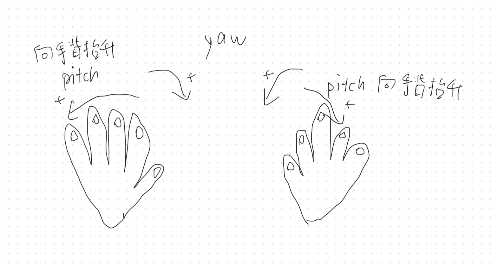

# lib_get_finger_angles

## NOTICE!!!

* 由於mediapipe handlandmarks不能夠檢測左手右手，所以在使用left_pitch，right_pitch,left_yaw,right_yaw的時候，只能在屏幕中出現該側手掌

## Requirement:

1. camera: intel realsense
2. lib needed: mediapipe, pyrealsense2

## Vedios:

1. finger angle

https://github.com/yupose-martin/lib_get_finger_angles/assets/114896246/948096c8-91d1-45d4-87d6-5e00d7cb0f88

2. pitch yaw

## Functions:

### pitch yaw

* get_abs_left_hand_pitch
* get_abs_right_hand_pitch
* get_abs_left_hand_pitch
* get_abs_right_hand_pitch

### finger angles:

* get_abs_finger_angle: absolute angle
* get_finger_angle: angle relevent to the static angle

### finger curves:

curve = (angle1 + angle2 + angle3) / 3

* get_abs_finger_curve: relevent to the static point
* get_abs_finger_curve: absolute

## Mainfile:

### lib_get_finger_angles.py

* the core lib

### demo.py

* shows you how to use it

## todo

1.手指收縮張開角度方向

## info

* 每個手指關節點相對於wrist的點是在相機坐標系下 u v
